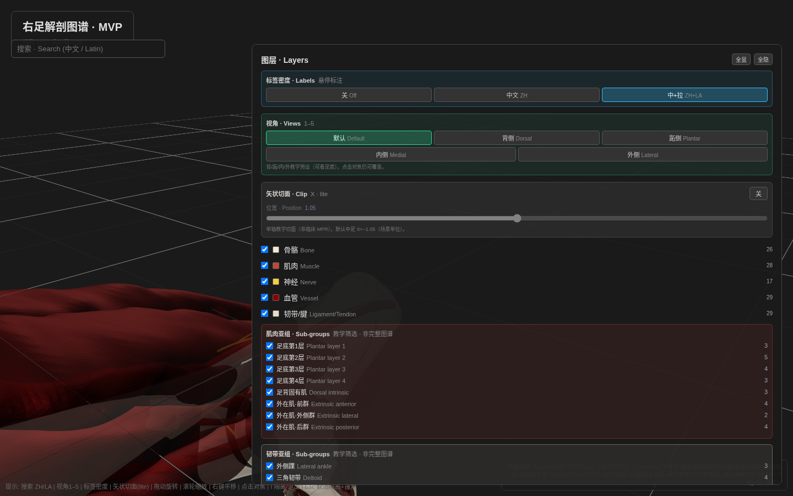
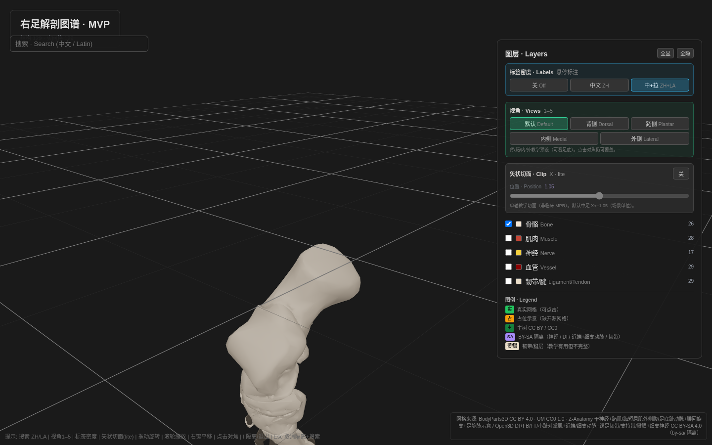
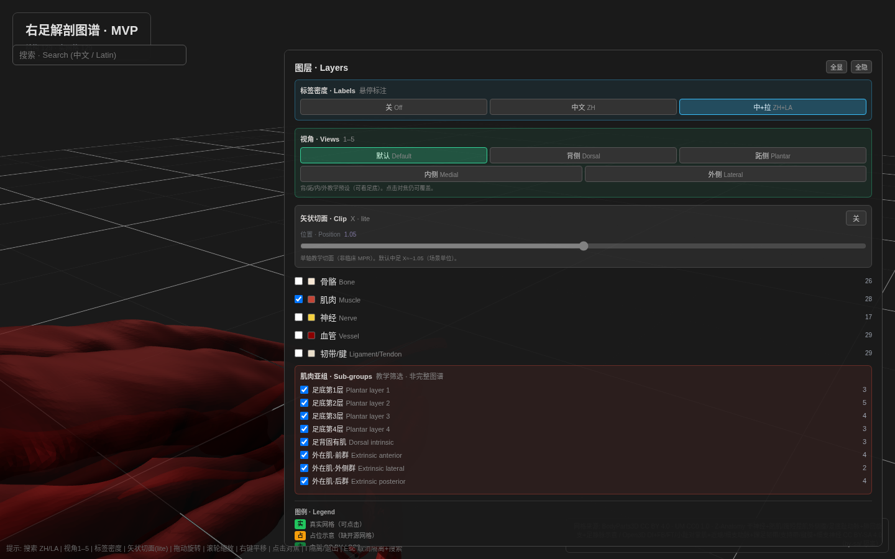
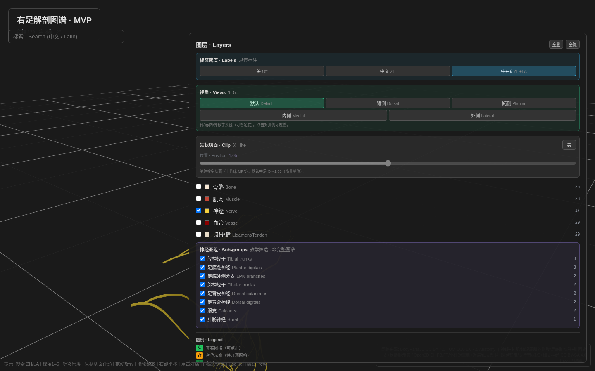
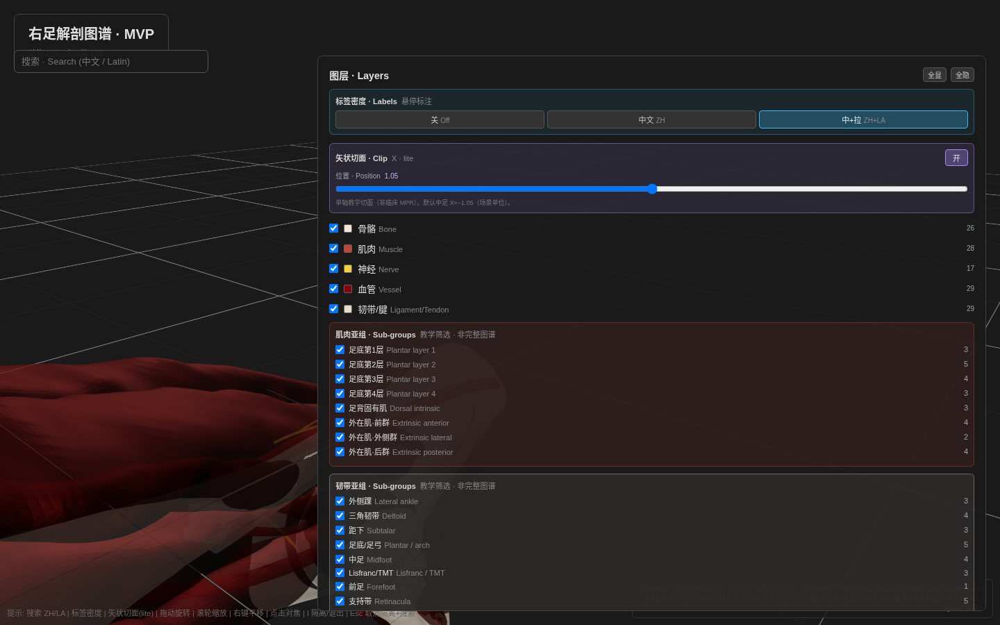
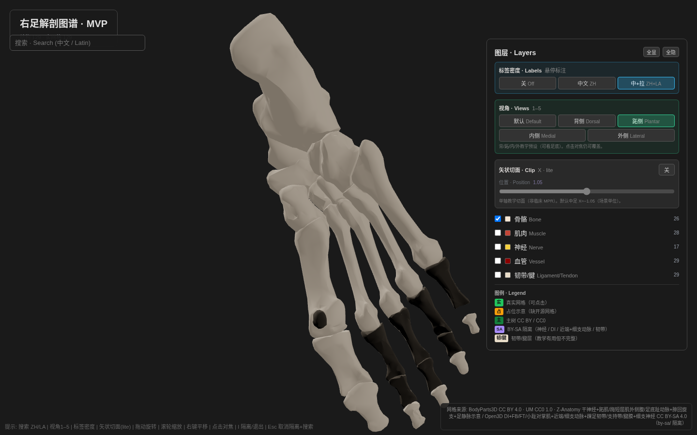
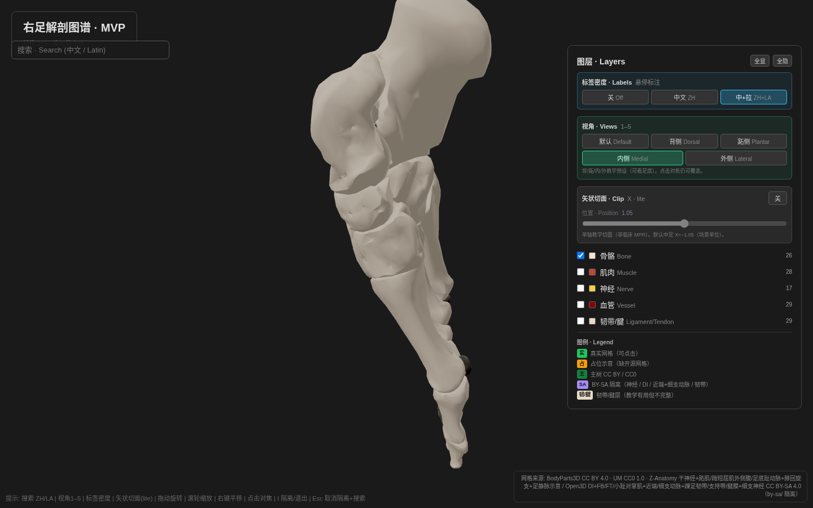
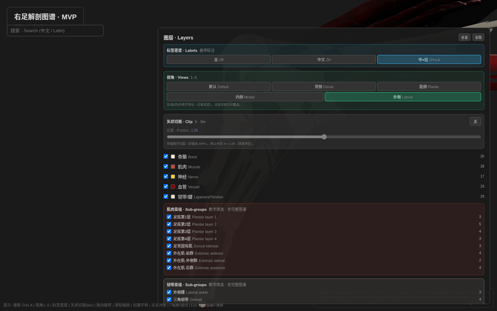

# Right Foot Anatomy Atlas · 右足解剖图谱

Interactive web-based teaching atlas for right foot anatomy.  
基于Web的交互式右足解剖教学图谱。

> ⚕️ **Educational Use Only**: Teaching-grade anatomical resource for medical students, anatomy instructors, and foot/ankle residents. Not for clinical diagnosis or treatment planning.

---

## Coverage

| Layer | Real Meshes | Placeholder | Total | Sources |
|-------|-------------|-------------|-------|---------|
| **Bones** | **26/26 (100%)** | 0 | 26 | BP3D (26) — **main tree** |
| **Muscles** | **23 unique / 28 entries** | 0 | 23 | Main: BP3D + UM (18 unique, incl. EHB) · **BY-SA**: Open3D DI+FB+FT+opponens + ZA plantaris (5); FHB lat ADDITIONAL |
| **Vessels** | **29** | 0 | 29 | Main: BP3D 7 (incl. 2 honest grouped) · **BY-SA**: Open3D 12 + ZA 10 (Day 4ad–4af arteries/veins; some grouped) |
| **Nerves** | **17** | 0 | 17 | Z-Anatomy trunks 6 + Open3D fine/cutaneous/calcaneal/dorsal digitals 11 (BY-SA `by-sa/`); **not** TA2-complete |
| **Ligaments / tendons** | **29** | 0 | 29 | Main: BP3D long plantar + Achilles · **BY-SA**: Open3D 27; **teaching-useful, incomplete** |
| **Unique total** | **124 real** | **0** | **124** | See main vs BY-SA split below (live census 2026-09-15 Day 4af) |

### Main tree vs BY-SA isolate (honest split)

| Claim | Unique count | Contents |
|-------|--------------|----------|
| **Main (CC BY 4.0 / CC0)** | **53/124** | 26 bones + 18 unique muscles + 7 vessels + 1 ligament + 1 tendon |
| **BY-SA isolate (`by-sa/`)** | **71/124** | 5 muscles (DI+FB+FT+opponens+plantaris) + 22 vessels (12 Open3D + 10 ZA) + 17 nerves + 27 ligaments·retinacula·fascia |
| **Entry-level `structures.json`** | **129/129** `placeholder:false` | Multi-part muscles counted separately (lumbricals/PI) |

**Note**: Unique framing = **124** (lumbricals×4→1, plantar interossei×3→1). Entry-level = **129** rows. **Honest grouped vessels**: BP3D dorsal digital + plantar metatarsal; Open3D **dorsal metatarsal** + **medial tarsal arteries**; ZA common/proper plantar digitals + several vein plurals also **grouped only**. Open3D / ZA ShareAlike fills are Kabsch→BP3D mm — **not** CC BY main-tree. **Skipped as BP3D/Open3D duplicates** where noted in phase-5. **Ligament + nerve + vessel layers: teaching-useful but incomplete** (no per-ray MTA; venous fill expanded Day 4ae–4af, still not complete; several grouped teaching meshes). Nerve, vessel, **and muscle** UI have teaching sub-group filters (not finished atlases). Muscle census: `docs/muscle-gap-census.md` (EHB/FB/FT/opponens/plantaris wired; gastroc/soleus bellies still open).

### Remaining soft-tissue caveats (not “gaps” in placeholder sense)
- Prefer future **CC0/CC BY** replacements for Open3D/ZA BY-SA soft fills; per-ray dorsal/plantar MTA still unavailable. Day 4ac+: Blender mesh-API ZA harvest for unique vessels/veins; ankle bands still absent from that `.blend` (Open3D remains source)
- Cuboid + 3 cuneiforms remapped (Day 4j). Hallux proximal remapped `BP8488`→`BP8785` (Day 4k). Distal phalanges 2–5: UM Y≈−850 meshes replaced with BP3D ISA elemental
- **UM muscles** (8): Kabsch-similarity baked into BP3D mm (Day 4l; mean residual ≈2.2 mm on 7 tarsal landmarks) — teaching-grade, not surgical registration
- **Ligaments / fascia / tendon**: see `docs/week2-ligament-fascia-search.md` Day 4s–4w — BP3D = long plantar + Achilles; Open3D → **27** BY-SA teaching meshes (Day 4w +2 previously deferred: medial talocalcaneal, dorsal intercuneiform). Z-Anatomy `.blend` export recipe only
- Teaching-grade atlas in progress — **no finished-product claim**

---

## License Map

| Component | License | Redistribution |
|-----------|---------|----------------|
| **Code** (`src/`, `vite.config.ts`, etc.) | MIT | ✅ Free, commercial OK |
| **Bones + most vessels** | CC BY 4.0 (BodyParts3D) | ✅ Free, attribution required |
| **Muscles** | CC BY 4.0 (BP3D) + CC0 1.0 (UM) | ✅ Free, no strings (UM) |
| **Nerves** (in `by-sa/` only) | CC BY-SA 4.0 (Z-Anatomy trunks + Open3D fine/cutaneous/calcaneal) | ⚠️ ShareAlike if modified |
| **DI + proximal/fine/tarsal/calcaneal/perforator arteries + ankle/foot ligaments/retinacula/fascia + fine nerves** (`by-sa/`) | CC BY-SA 4.0 (Open3DModel) | ⚠️ ShareAlike if modified |
| **Ligament + tendon** (long plantar + Achilles) | CC BY 4.0 (BodyParts3D) | ✅ Attribution; soft-tissue incomplete |

**User Choice**: Muscle / vessel / nerve / ligament layers may load BY-SA meshes (DI, PTA, fibular, deep plantar/arch, grouped dorsal MTA, medial plantar branches, tarsal/calcaneal/perforator aa., nerves, ankle/foot ligaments, retinacula, fascia). Skip those layers or delete `by-sa/` → MIT + CC BY/CC0 only.

---

## Features

- **5-layer toggle**: Bone / Muscle / Nerve / Vessel / Ligament-Tendon (soft-tissue teaching-useful but incomplete — BP3D 1+1 + Open3D BY-SA 27)
- **Ligament sub-group filter**: lateral ankle / deltoid / subtalar / plantar-arch / midfoot / Lisfranc / forefoot / retinacula / tendon
- **Nerve + vessel + muscle sub-group filters**: teaching partitions (not complete atlases)
- **Muscle sub-groups**: plantar layers 1–4 / dorsal intrinsic / extrinsic anterior·lateral·posterior
- **License badge**: StructurePanel shows **主树 · Main** vs **ShareAlike** (by-sa/ isolate)
- **Label density**: hover chips 关 / 中文 / 中+拉 (Day 4ai)
- **Sagittal clip (lite)**: single X-axis teaching cutaway + slider — **not** clinical MPR (Day 4aj)
- **Camera presets**: 默认 / 背侧 / 跖侧 / 内侧 / 外侧 (keys `1`–`5`) — plantar sole view enabled (Day 4an)
- **Keyboard help overlay**: `?` / `H` or title **? 帮助** — bilingual shortcut sheet (Day 4ao); Esc closes help first
- **Teaching prefs persist**: localStorage restores layer visibility, label density, sagittal clip, last camera preset (Day 4ap; teaching chrome only)
- **Ontology IDs (partial)**: StructurePanel shows TA2 / FMA / BP when mapped (`src/lib/ontologyIds.ts`); honest empty when unknown (Day 4aq)
- **Click selection**: Shows Chinese name, Latin name (TA2), summary
- **Click-to-focus**: Camera frames selected mesh AABB (teaching polish)
- **Hover tooltips**: Quick structure identification
- **OrbitControls**: Zoom, rotate, pan around foot (full polar range for plantar teaching)
- **Loading states**: Progress indicators for GLB assets
- **Per-structure hide**: Hide this (X) chip beyond isolate; restore chips for hidden names; ids persist in teaching prefs (Day 4au/4av; undergravity UX-borrow)
- **Keyboard**: `?`/`H` help · `1`–`5` view presets · `I` isolate · `X` hide this · `Esc` closes help or clears selection + isolate + search (**not** per-structure hides — those persist in teaching prefs)
- **Search**: bilingual ZH/LA includes ligament/tendon entries (e.g. 跖长韧带, 跟腱); results sorted by teaching layer after match score
- **Screenshot pack** (optional): `npm run screenshots` → `docs/screenshots/` (teaching QA; not a product gallery)

---

## Teaching QA screenshots

Optional pack for expert review (`docs/screenshots/`, generated by `npm run screenshots`). **Not** a finished-product gallery — soft tissue remains incomplete; nerve / many soft meshes are BY-SA isolate.

| Shot | What it shows |
|------|----------------|
| Default layers | All teaching layers on; label density ZH+LA; clip lite off |
| Bone only | Osteology 26/26 (main tree), default oblique |
| Muscle only | Intrinsic + extrinsic teaching set (incomplete; no gastroc/soleus bellies) |
| Nerve + BY-SA | Nerve layer alone — ShareAlike isolate visible in legend / panel warning |
| Sagittal clip lite | Single-axis X cutaway on — teaching slice, **not** clinical MPR |
| Bone dorsal / plantar / medial | Multi-view expand (Day 4an) — osteology from +Z / −Z / +X |
| All layers lateral | Lateral preset overview (−X) |

<p align="center">
  
  
</p>
<p align="center">
  
  
</p>
<p align="center">
  
  
</p>
<p align="center">
  
  
</p>
<p align="center">
  
</p>

Regenerate after UI changes: `npm run build && npm run screenshots`. Captions and honesty note also live in `docs/screenshots/README.md` + `manifest.json`.

---

## Tech Stack

- **Frontend**: Vite + React 18 + TypeScript 5
- **3D Engine**: Three.js + React Three Fiber + @react-three/drei
- **Data**: `structures.json` (129 entries, TA2-oriented naming; not TA2-complete)
- **Assets**: Main-tree GLBs + `by-sa/` structure GLBs (17 nerves + soft muscles + 22 vessels + 27 ligaments/retinacula/fascia)
- **Testing**: Vitest + integrity-audit.py

---

## Quick Start

```bash
# Install dependencies
npm install

# Development server
npm run dev

# Production build
npm run build

# Run tests
npm test
```

Open `http://localhost:5173` to view the atlas.

---

## Data Sources

### BodyParts3D Release 4.0 (CC BY 4.0)
- **Provider**: Database Center for Life Science (DBCLS), Japan
- **DOI**: 10.18908/lsdba.nbdc00837-007
- **URL**: https://dbarchive.biosciencedbc.jp/en/bodyparts3d/
- **Coverage**: 14 bones, 12 muscles, 5 vessels
- **Attribution**: "BodyParts3D, © The Database Center for Life Science licensed under CC Attribution 4.0 International"

### Universiti Malaya Asian Male LE MSK (CC0 1.0)
- **DOI**: 10.22452/RD/5T6TZ7
- **URL**: https://researchdata.um.edu.my/dataset.xhtml?persistentId=doi:10.22452/RD/5T6TZ7
- **Coverage**: 8 muscles (5 intrinsic + 3 extrinsic), high-resolution STL
- **License**: Public Domain (CC0), no attribution required
- **Alignment**: Baked UM CT/segmentation mm → BP3D foot mm via Kabsch similarity on Calcaneus/Talus/Navicular/Cuboid/3 cuneiforms (mean residual ≈2.2 mm); transform at `third_party/um/um_to_bp3d_transform.json`; render scale stays `0.01`

### Z-Anatomy (CC BY-SA 4.0, isolated)
- **Repository**: https://github.com/Z-Anatomy/Models-of-human-anatomy
- **Coverage**: 6 Z-Anatomy CURVE trunk nerves (+ separate Open3D fine/cutaneous under same `by-sa/`; 17 nerve entries total)
- **Isolation**: `public/models/right-foot/by-sa/` + NOTICE.md
- **Attribution**: "Z-Anatomy - The libre 3D atlas of anatomy - CC BY-SA 4.0"

### Open3DModel / AnatomyTOOL (CC BY-SA 4.0, isolated)
- **Create page**: https://anatomytool.org/open3dmodel-create
- **Coverage**: DI (1st–4th) + FB/FT/opponens + proximal/fine/tarsal/calcaneal vessels + 27 ankle/foot ligaments·retinacula·fascia (BY-SA isolate; Kabsch→BP3D)
- **Isolation**: `public/models/right-foot/by-sa/` + NOTICE.md
- **Alignment**: Baked Open3D meters → BP3D mm via Kabsch on Calcaneus/Talus/Navicular/Cuboid/3 cuneiforms/MT1–5 (Day 4m re-fit after tarsal ID fix; mean residual ≈2.6 mm, prior 8-landmark ≈3.0 mm); render scale stays `0.01`

---

## Limitations

### Anatomical
- **BY-SA soft tissue**: DI + proximal PTA/fibular are Open3D ShareAlike fills (prefer future CC0/CC BY)
- **Ligament / fascia / tendon**: BP3D long plantar + Achilles; Open3D BY-SA **27** teaching meshes; further tarsal/toe bands still missing — **teaching-useful, not a finished ligament atlas**
- **Vessel fine detail**: Per-toe digital splits not available as separate BP3D meshes (honest grouped instead)
- **Nerve geometry**: Z-Anatomy CURVE tubes + Open3D volumetric fine branches (teaching-grade; commons/proprii grouped)
- **Extrinsic muscles**: Shown in full leg-to-foot extent (teaching context, not foot-only isolation)

### Technical
- **Not patient-specific**: Teaching-grade generic anatomy (not CT/MRI-derived)
- **Not validated for surgery**: Educational tool, not surgical planning software
- **ShareAlike module**: BY-SA 4.0 applies only to `by-sa/` directory (opt-in via layer toggles)
- **Asset load**: **134** discrete GLBs (~13 MB; 59 main + 75 `by-sa/`). Visibility-gated mount; bones eager-preload; other layers lazy-preload when toggled visible — **not** a single Draco pack

---

## Documentation

- **Design Spec**: `docs/superpowers/specs/2026-09-14-right-foot-anatomy-atlas-design.md`
- **Implementation Plan**: `docs/superpowers/plans/2026-09-14-right-foot-anatomy-atlas.md`
- **Asset Research**: `docs/assets-research-round2.md` (≥12 sources compared)
- **Terminology**: `docs/terminology.md` (TA2 Latin + PRC Chinese standards)
- **Methods**: `docs/methods.md` (data sources, extraction, journal-facing limitations table)
- **Contributing**: `CONTRIBUTING.md` (license boundaries, NC-trap exclusions)
- **Spatial Alignment QA**: `docs/spatial-alignment-qa.md` (0.01 scale verification)
- **Phase 6 self-review**: `docs/phase-6-self-review.md` (census, UX inventory, open-data ceilings)
- **Screenshots** (optional QA pack, embedded above): `docs/screenshots/` via `npm run screenshots` — not a product gallery

---

## Development Workflow

### Week Sprint Log (Sep 9-14, 2026)
- **Day 1**: BP3D soft tissue discovery (15 muscles + 3 vessels)
- **Day 2**: UM hybrid strategy (5 muscles, quality-optimized)
- **Day 3**: Vessel expansion (arcuate artery, 5/6 coverage)
- **Day 4**: Z-Anatomy nerve integration (6/6, Blender extraction)
- **Day 5**: UM extrinsic muscles (3 P0 + 4 teaching, 13/14 total)
- **Day 6**: README factual rewrite + interaction QA

See `docs/daily-log.md` for detailed progress.

---

## Tests

```bash
npm test
```

- ✅ `structureLookup.test.ts`: Structure retrieval by ID/meshName
- ✅ `layers.test.ts`: Layer visibility helpers

All tests pass (vitest suite; see `npx vitest run`).

---

## Contributing

See `CONTRIBUTING.md` for:
- License compatibility rules (MIT + CC BY/CC0 accepted, BY-SA isolated, NC rejected)
- Asset contribution guidelines
- Known NC traps to avoid (UBC Krebs textures, Zenodo 21354714, NIH 15850)

---

## Acknowledgments

- **BodyParts3D** team (DBCLS Japan) for osteology + myology base
- **Universiti Malaya** for high-resolution CC0 lower extremity STL
- **Z-Anatomy** project (Gauthier Kervyn, Marcin Zielinski) for nerve CURVE models
- **Terminologia Anatomica 2** for anatomical nomenclature standards
- All open-source contributors to BP3D, UM, Z-Anatomy projects

---

## License

**Code**: MIT License (see `LICENSE`)  
**Assets**: CC BY 4.0 / CC0 1.0 / CC BY-SA 4.0 (see `manifest.json` + `by-sa/NOTICE.md`)

---

**Project Status**: Teaching-grade atlas in progress (Week 2 / Phase 6) — **not a finished product**  
**Coverage**: **124** unique / **129** entries; main **53** vs BY-SA **71**; ligament/tendon teaching-useful but incomplete (BP3D 1+1 + Open3D 27)  
**Self-review**: `docs/phase-6-self-review.md`  
**Repository**: https://github.com/linjinmiao1985/right-foot-anatomy-atlas
